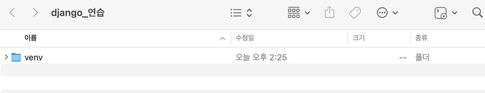
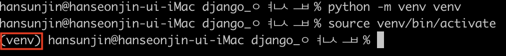
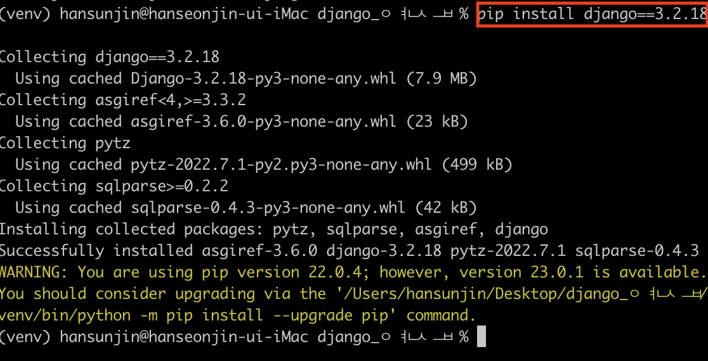
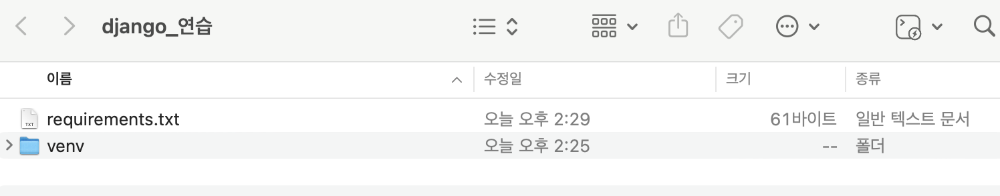
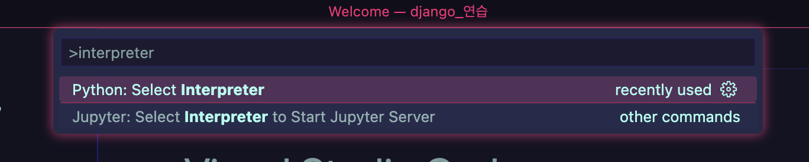
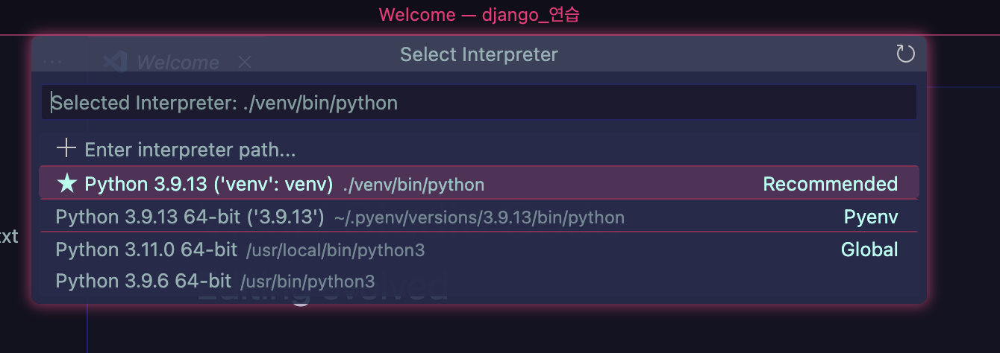
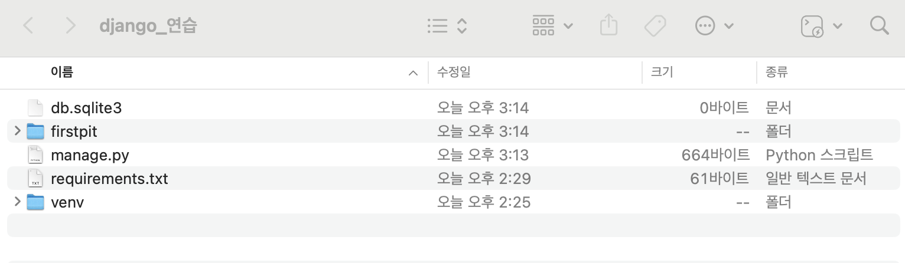

# Django

## 1. 가상환경 (venv 생성)

> python -m venv venv

## 2. 가상환경 활성화

> Source venv/bin/activate

## 3. django 설치

> pip install django==3.2.18

## 4. 의존성 파일 생성

> pip freeze > requirements.txt

    4-1 .git ignore 파일 생성 (첫 add 전)

    4-2 git 저장소 생성

## 5. django 프로젝트 생성

cmd + shift + p 누른 후 interpreter 검색

⭐️ python 3,9,13 선택 후에 밑에 입력

> django-admin startproject firstpjt .

### 맨 끝에 '.' 빼먹지 말것

## 6. 서버 실행

> python manage.py run server

↪️ 총 만들어진 파일

### 서버 종료

> Ctrl + c

---

### 페어 입장에서 받을때 venv 가 없다 !

## 1. 가상환경 만들기

> python -m venv venv

### 설치된거 확인하기

> pip list

## 2. 설치하기

> pip install -r requirements.txt

---

[gitignore 사이트](https://www.toptal.com/developers/gitignore/)
